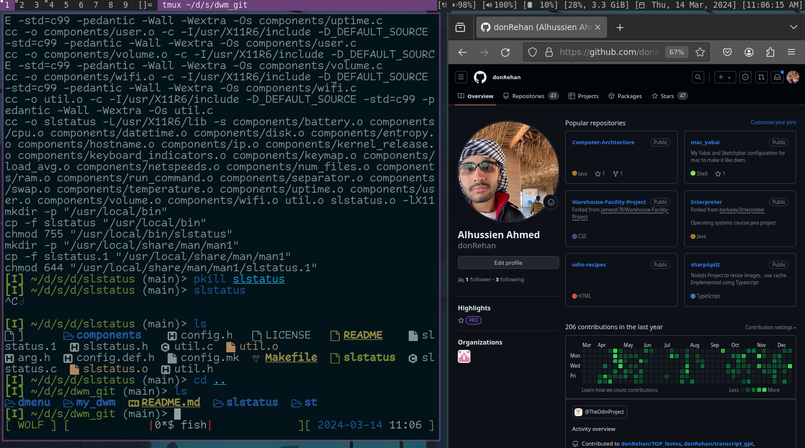

# My dwm config


```c
static const char *dmenucmd[] = { "dmenu_run", "-c" , "-l" , "10" , "-m", dmenumon, "-fn", dmenufont, "-nb", col_gray1, "-nf", col_gray3, "-sb", col_cyan, "-sf", col_gray4, NULL };
```
> This code above simply is a command and is broken down to its components as 
> part of the array ie 
dmenu_run -c -l 10 becomes ["dmenu_run", "-c", "-l", "10"]

## Volume using keyboard buttons
One thing to note in dwm is that it is very minimal , unlike in I3wm where 
at least it stores the volume up down of your keyboard dwm doesn't have that.
In order to achieve that 

First thing will need to import xf86 header ( header of volume control buttons & other special buttons)
```c
//To be included in the top of your config.h file
#include <X11/XF86keysym.h>

```

Next up in keys will need to add rules for such
```c
static const Key keys[] = {
/* ...
....
...
*/
```

will add the following collection
```c
	{ 0, XF86XK_AudioMute,		spawn,		SHCMD("pactl set-sink-mute @DEFAULT_SINK@ toggle") },
	{ 0, XF86XK_AudioRaiseVolume,	spawn,		SHCMD("pactl set-sink-volume @DEFAULT_SINK@ +5%") },
	{ 0, XF86XK_AudioLowerVolume,	spawn,		SHCMD("pactl set-sink-volume @DEFAULT_SINK@ -5%") },
	{ 0, XF86XK_AudioPause,		spawn,		SHCMD("pactl suspend-sink 0") },
	{ 0, XF86XK_AudioPlay,		spawn,		SHCMD("pactl suspend-sink 0") },
	{ 0, XF86XK_AudioStop,		spawn,		SHCMD("pactl suspend-sink 1") },

```

At least thats how I do it. You will need to have pactl installed and first before adding the Shell command 
associated with your buttons test them from a terminal first and see if everything is working fine on your 
machine.

## Adding screen shot functionality
Software I use for taking screen shots is flameshot 
I bind modkey shift s to flameshot gui to take screen shots as such
```c
{ MODKEY|ShiftMask,             XK_s,  spawn, SHCMD("flameshot gui") },
```
## Added battery status 
Using slstatus Now battery percentage is shown alongside its state wether 
its charging or not. This is shown by a little socket unicode character 
that I added in components/battery.c and removing the other states.

then adding the following in config.h for slstatus
```c
	{ battery_state, "[%s ",  "BAT0"},
	{ battery_perc, "🔋%s%]",  "BAT0"},
```

## Addition of keyboard layout changing 

This is done by creating the folder called scripts_lab inside of it is 
change_keyboard_layout.sh

Below is the shell script and its explaination

```bash 
#! /bin/bash

export layout=$(setxkbmap -query | awk 'NR == 3 {print $2}')

if [[ $layout == "us" ]]; then
    setxkbmap -layout ar -option ctrl:swapcaps
elif [[ $layout == "ar" ]]; then
	setxkbmap -layout us -option ctrl:swapcaps
fi
```
using setxkbmap -query I get something similar to the following

```
rules:      evdev
model:      pc105
layout:     us
options:    ctrl:swapcaps
```
in the third line is the layout currently active.
Hence pipelining the output to awk NR == 3 returns the third line
IE layout : us
here I want to capture only us I do so using print $2 
from there I use if else statement to call method to switch the 
keyboard layout

In my config.h I have the following set up where I call the script each
time I use the key combination that I chose for it.
```c
{ MODKEY|ShiftMask,             XK_Tab, spawn,          SHCMD("$HOME/dev/scripts_lab/change_keyboard_layout.sh") },
```

Finally in slstatus I also added a section to report the keyboard 
layout being used so it gives a natural wm feel in dwm.

# Old documentation 
### In this location create the following file
> /usr/share/xsessions 
> dwm.desktop

then add the following to its contents

```
[Desktop Entry]
Encoding=UTF-8
Name=dwm
Comment=the dynamic window manager
Exec=dwm
Icon=dwm
Type=XSession

```

### to fix Dwm craching because of emojis I installed ttf-symbola 

> sudo apt install ttf-symbola

### Transparency was by installing picom and then adding the following to my xsessionrc

```bash
#!/bin/bash
picom &
nitrogen --restore &
setxkbmap -option ctrl:nocaps &

dwm 
```

### As can be seen here also in my .xessionrc file I have setxkbmap to change caps lock to ctrl.

Shortcuts ::
Alt [Mod] + Shift + B which opens chromium.
Alt [Mod] + Shift + S which opens Screenshot software.
Alt [Mod] + Q which runs a script to display the current date and time.
Alt [Mod] + R Turns of opactiy in Alacritty
Alt [Mod] + E Turns of opactiy in Alacritty

Time script
```bash
#!/bin/bash

while true; do
    now="$(date +'%I:%M %p %d/%m/%Y')"
    xsetroot -name "$now"
    sleep 60
done
```

Remove opactiy script
```bash
#!/bin/bash

# Path to the .alacritty.yml file
alacritty_file="$HOME/.alacritty.yml"

# Update the opacity value to 0
sed -i 's/opacity: [0-9.]\+/opacity: 0.9/' "$alacritty_file"
```

Return opactiy script
```bash
#!/bin/bash

# Path to the .alacritty.yml file
alacritty_file="$HOME/.alacritty.yml"

# Update the opacity value to 0
sed -i 's/opacity: [0-9.]\+/opacity: 1/' "$alacritty_file"
```

## OS :: Linux Mint 
